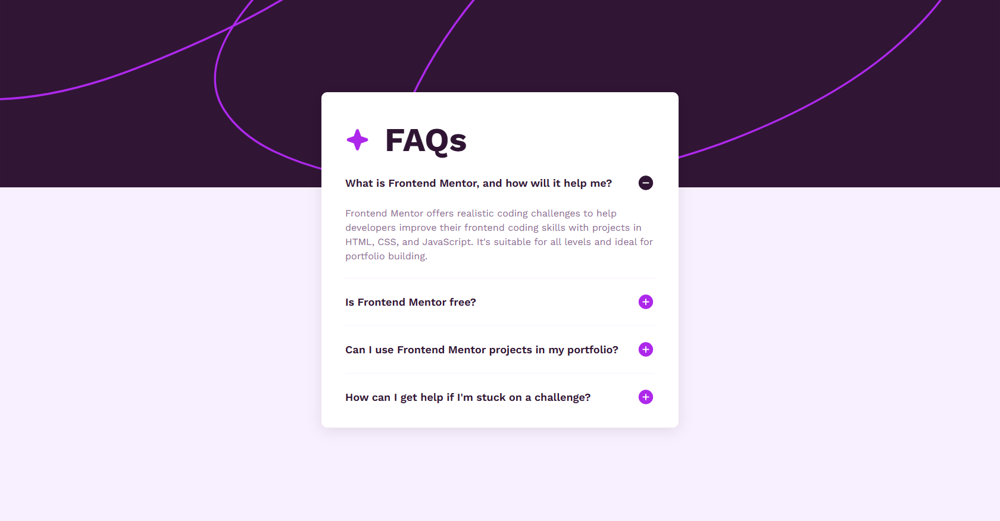

# Frontend Mentor - FAQ accordion solution

This is a solution to the [FAQ accordion challenge on Frontend Mentor](https://www.frontendmentor.io/challenges/faq-accordion-wyfFdeBwBz). Frontend Mentor challenges help you improve your coding skills by building realistic projects. 

## Screenshot

## Built with

- Semantic HTML5 markup
- CSS custom properties
- Flexbox
- Mobile-first workflow
- CSS clamp functions

## Links

- [Solution page](https://www.frontendmentor.io/solutions/faq-accordion-using-html-and-css-wTNC_d_te9)
- [Live site](https://risaysky.github.io/Frontend-Mentor-FAQ-accordion/)
